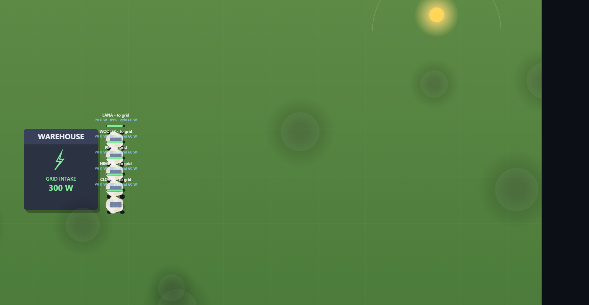

# Solar Sheep — autopilot panels

A browser simulation of a herd of solar-panel sheep. Each sheep carries a small PV
panel on its back and a battery. During the day the herd leaves the warehouse
(staggered — each sheep wakes a random time after sunrise), wanders the pasture
turning to track the sun, and when a battery fills up (or the sun drops) it comes
home to deliver its stored energy to the grid. The warehouse itself has a fixed
roof PV array that feeds the grid directly, so the two power sources are metered
separately.

Everything runs client-side in vanilla JavaScript + Canvas 2D. No build step,
no dependencies.



## Run it

There is nothing to install. Serve the folder with any static file server and
open it in a browser:

```sh
# from this directory
python -m http.server 8765
# then open http://localhost:8765
```

If the port is already in use, a server is already running — just open
http://localhost:8765. `index.html` can also be opened directly from disk; all
scripts are plain `<script>` tags with no modules or bundling.

## Controls

| Control | What it does |
| --- | --- |
| `pause` / `0.5x` / `1x` / `10x` / `30x` / `100x` | Simulation speed (default `10x`). |
| `+1h` | Jump the clock ahead one simulated hour instantly. |
| `space` | Toggle pause / resume. |
| Click a **sheep** | Live details: PV now, sun exposure, battery, grid output, motor draw, produced/harvested/delivered today. |
| Click the **warehouse** | Site details: grid intake now (split herd vs. roof PV), sheep on site, energy in herd, totals, end-to-end efficiency. |
| **Tuning** sliders | Herd size (1–12), battery capacity (100–2000 Wh), panel rating (50–600 W), roof PV (0–1000 W). |
| **Apply and restart sim** | Rebuild the simulation with the new settings (resets the clock and totals). |

## What the simulation models

- **Day / night** — Sunrise `06:00`, sunset `18:00`, recall home ~`17:20`
  (±15 min per sheep). Solar output follows a sine curve peaking at midday.
  The sim starts on Day 1 at `06:30`.
- **Random weather** — `clear` / `cloudy` / `overcast`, each lasting 1–4
  sim hours, rolled randomly. Weather scales all solar output (×1.0 / ×0.8 /
  ×0.45) and drives the target cloud count (4 / 8 / 14), so the sky visibly
  thickens and thins.
- **Sun tracking** — While sunning, each sheep physically turns toward the sun
  (turn-rate limited, with a per-sheep 85–100% tracking skill). Panel output
  is `peakW × sun × cloudShade × exposure × weather`, where
  `exposure = max(0, cos(angleError)) × skill` — a sheep parked the wrong way
  around genuinely produces less (shown as `face N%` on canvas and in the
  details panel).
- **Clouds** — Drifting cloud blobs shade any panel beneath them to 45% of
  the clear-sky value.
- **The sheep state machine**

  ```
  resting → toField → harvesting → toWarehouse → delivering → (resting or toField)
  ```

  - `resting` — back at the warehouse dock at night.
  - `toField` — driving to its assigned pasture slot.
  - `harvesting` — wandering the pasture, generating power into its battery.
  - `toWarehouse` — driving home (battery full, or recall time reached).
  - `delivering` — at the dock, discharging into the grid until near-empty.

- **Warehouse roof PV** — A fixed panel on the roof (`roof PV` slider, 300 W
  default) producing `peakW × sun × weather` straight to the grid, no battery.
  Its intake is metered and charted **separately** from the herd's.

- **Energy model** — Sheep charge a `battery.capacityWh` (500 Wh default) pack
  at 95% charge / 95% discharge efficiency with a 5% reserve SoC floor.
  Driving draws a 30 W motor; delivery pushes up to 60 W to the grid per
  sheep; a battery counts as "full" at 95% SoC.

## Metrics

The header, the on-screen **LIVE METRICS** overlay (bottom-right of the scene),
and the warehouse panel all agree, and the books balance exactly:
`produced = delivered + lost + energy still in herd`.

- **Produced** — gross PV Wh captured (sheep panels + roof).
- **Harvested** — Wh actually stored in sheep batteries.
- **Delivered** — Wh pushed to the grid (sheep + roof).
- **Lost** — motor burn, charge/discharge losses, and clipped solar that had
  nowhere to go.
- **Eff** — end-to-end efficiency, delivered / produced.
- **PV now / grid now / motor** — live aggregate power (W).
- **Grid power (last 24h)** — live two-line chart: green = sheep, amber = roof
  PV, with night hours shaded.
- **Cost estimate** — live breakdown in the Tuning panel as you slide:
  panels (£0.80/W), batteries (£120/kWh), roof PV, motors & wheels
  (£150/sheep), inverter (£300) → total £ and £/kWh delivered.

## Architecture

| File | Responsibility |
| --- | --- |
| `index.html` | Layout, styling, UI controls, and script load order. |
| `config.js` | `CONFIG` object — the single source of all tunable numbers and prices. |
| `simulation.js` | Core simulation: state machine, weather, orientation/exposure, energy model, roof PV, time stepping, history. |
| `render.js` | All Canvas drawing: field, warehouse, rotating sheep, clouds, sun, particles, metrics overlay, 24h chart. |
| `main.js` | UI wiring: rAF loop, speed control, selection, tuning, cost panel, HUD/panel updates. |

### `CONFIG` reference

| Key | Default | Meaning |
| --- | --- | --- |
| `world.w` / `world.h` | `1600` / `1000` | World dimensions the camera scales to fit. |
| `warehouse` | `{x:70,y:380,w:220,h:240}` | Warehouse rectangle (also holds the dock). |
| `startDay` / `startHour` | `1` / `6.5` | Simulation start time. |
| `substep` | `0.5` | Fixed physics substep in seconds. |
| `sunrise` / `sunset` | `21600` / `64800` | Seconds-of-day for sunrise/sunset. |
| `recallTime` | `62400` | Base seconds-of-day the herd is called home (17:20). |
| `sun.cloudShade` | `0.45` | Multiplier on panel output under a cloud shadow. |
| `clouds` | `{count:8, speed:6, minR:60, maxR:130}` | Initial cloud population, drift speed, radius range. |
| `weather.states` | clear/cloudy/overcast | Per-state solar factor, target cloud count, pick weight. |
| `weather.minDurH` / `maxDurH` | `1` / `4` | Weather spell duration range (sim hours). |
| `sheep.count` | `5` | Herd size. |
| `sheep.wakeSpreadSec` | `2700` | Herd departure stagger window after sunrise. |
| `sheep.recallJitterSec` | `900` | Per-sheep recall time, ± this. |
| `sheep.turnRate` | `0.6` | rad/s — how fast a sheep can turn to face the sun. |
| `sheep.trackSkillMin` / `Max` | `0.85` / `1.0` | Per-sheep tracking quality (sloppy → precise). |
| `panel.peakW` | `200` | Sheep panel peak output in watts. |
| `whPanel.peakW` | `300` | Warehouse roof PV peak output in watts. |
| `battery.capacityWh` | `500` | Battery capacity in Wh. |
| `battery.chargeEff` / `dischargeEff` | `0.95` / `0.95` | Charge / discharge efficiency. |
| `battery.reserveSoc` | `0.05` | SoC floor (fraction) the battery will not go below. |
| `motor.powerW` | `30` | Continuous motor draw in watts. |
| `motor.travelSpeed` / `harvestSpeed` | `45` / `12` | Drive speed, and slower wander speed while harvesting (world units/s). |
| `grid.dischargeW` | `60` | Max delivery rate to the grid per sheep. |
| `fullThreshold` | `0.95` | SoC at which a battery is considered full. |
| `chart.bucketSec` / `keepSec` | `60` / `86400` | Grid-power chart resolution and 24h window. |
| `cost.*` | see file | £ prices for panels (per W), batteries (per kWh), drives (per sheep), inverter (fixed). |